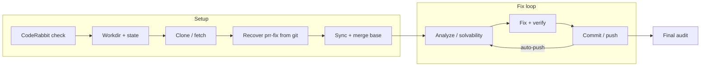

# Guide for AI coding agents

This file helps AI assistants (Cursor, Claude Code, Aider, etc.) work effectively in this repo.

## Generated artifacts (not committed)

These are created by tools and should not be committed: `.split-plan.md`, `.split-rewrite-plan.yaml` (or `.split-rewrite-plan.md`/`.json` — rewrite plan for split-exec), `.split-exec-workdir/` (clone workdir for split-exec), `.split-rewrite-plan-workdir/` (clone workdir for split-rewrite-plan), `split-exec-output.log`, `split-exec-prompts.log`, `split-plan-output.log`, `split-plan-prompts.log`, `pill-output.md`, `pill-summary.md`, `output.log`, `prompts.log`. See `.gitignore`.

**Committed generated data:** **`generated/model-provider-catalog.json`** is checked in on purpose. It lists current **Anthropic** and **OpenAI** API model IDs scraped from the official doc URLs in `docs/MODELS.md`, plus hyphenless lookup keys (e.g. `gpt5mini` → `gpt-5-mini`) so tools can treat vendor spellings as authoritative. Refresh locally with **`npm run update-model-catalog`**; CI runs **`.github/workflows/refresh-model-catalog.yml`** on a weekly schedule. Override path with **`PRR_MODEL_CATALOG_PATH`**. Loader: **`shared/model-catalog.ts`**. If the file is **missing, unreadable, or invalid**, the loader **warns once per path** and returns an **empty catalog** (no throw) so PRR keeps running; **0a6** dismissal and auto-heal need a valid JSON snapshot.

**PRR vs stale bot model advice:** Some review bots claim a valid API id is wrong and suggest another valid id. **WHY dismiss:** That is not a real fix task when both strings appear in the catalog — it would waste fix-loop iterations and risk applying the wrong id. **`assessSolvability`** check **0a6** (`tools/prr/workflow/helpers/outdated-model-advice.ts`) returns `not-an-issue`. **WHY auto-heal:** If the branch already contains the bot’s suggested id inside quotes/backticks near the comment line, **`applyCatalogModelAutoHeals`** (`catalog-model-autoheal.ts`) restores the catalog-correct id in quoted literals (±20 lines around the anchor, then **full-file fallback** if needed). If the file already has the catalog id and the wrong id never appears quoted, it **`markVerified`** with no disk edit (**`catalog-autoheal-noop`**). **WHY `verifiedThisSession`:** Commits are gated on verified session ids; heal calls **`markVerified`** so **`commitAndPushChanges`** can run on the “all resolved, no fix loop” path when the only dirty change is the heal. Opt out: **`PRR_DISABLE_MODEL_CATALOG_SOLVABILITY`**, **`PRR_DISABLE_MODEL_CATALOG_AUTOHEAL`**. Details: **DEVELOPMENT.md** (Commit gate and catalog model auto-heal), **docs/MODELS.md**.

**Pill hook:** Pill runs on close only when the user passes **`--pill`** on the command line. **prr**, **split-exec**, **story**, and **split-plan** accept `--pill`; after parsing, they call `setPillEnabled(true)`. After shutdown, each entry point calls **`closeOutputLog()`** then **`runPillAfterClosedLogs()`** (`tools/pill/after-close-logs.ts`) so **`shared/`** does not import **`tools/pill/`**. When `--pill` is not passed, pill does not run. **WHY opt-in:** Default runs stay fast; tools like split-exec have no LLM calls, so pill would often have nothing to analyze. When `--pill` is set, pill runs if the output log has content or the prompts log has PROMPT/RESPONSE/ERROR entries.

**prompts.log:** `initOutputLog()` always opens `prompts.log` (or `{prefix}-prompts.log`) next to `output.log`. **Full** prompt/response text is appended when the **in-process** LLM path runs (`LLMClient.complete()` → `debugPrompt` / `debugResponse` in `tools/prr/llm/client.ts`), not when `--verbose` is set. The file stays **empty** if the run never calls that path (e.g. exits before any LLM, or only subprocess fixers). Entries with zero content between markers indicate a logging bug or empty model output; pill and audit cycles rely on non-empty bodies. If the provider returns **success with an empty/whitespace body**, the client writes an **`ERROR`** line for that slug (so audits do not see a PROMPT with no paired RESPONSE); merge/conflict steps set **`phase`** in metadata for grep (e.g. `conflict-syntax-fix`, `conflict-chunk`).

**Troubleshooting empty prompts.log:** If the **primary LLM path** (in-process, e.g. elizacloud via `tools/prr/llm/client.ts`) produces empty PROMPT/RESPONSE entries, the fix is in that code path: ensure the full prompt string is passed to `debugPrompt()` and the full response body to `debugResponse()` (e.g. after streaming, pass the accumulated content, not a placeholder). `shared/logger.ts`'s `writeToPromptLog` refuses zero-length or whitespace-only body and **warns to stderr** (and console) with the slug and a stack trace so you can identify the caller. If most entries in prompts.log are from **llm-elizacloud** and every body is empty, the streaming path in the elizacloud client may not be passing the accumulated response to the logger — check `shared/llm/elizacloud.ts` (or the code that calls `debugResponse()` after streaming). Check that `initOutputLog()` was called before the first LLM call and that `promptLogStream` is non-null.

**⚠️ Known issue: empty prompts.log entries:** **When llm-api is the sole fixer**, the subprocess does not call `initOutputLog`, so **prompts.log entries for llm-api-fix will be empty** even though the fixer ran. This is expected behavior, not a bug. **Additionally, elizacloud streaming entries may also be empty** if the streaming path does not pass accumulated response content to the logger — this IS a bug (see troubleshooting section below). To audit llm-api fixer activity, use **`PRR_DEBUG_PROMPTS=1`** to get per-prompt files under `~/.prr/debug/`, or inspect `output.log` (e.g. `PROMPT #0001 → { chars: N }`) for evidence of calls. Do not waste time investigating empty llm-api-fix entries — they are expected to be empty. However, if you see empty elizacloud entries, investigate the streaming path.

**Crash / truncation:** Writes are buffered. If the process exits abruptly (crash, kill), the last entry may be missing or truncated. The logger uses cork/uncork per prompts.log entry so each PROMPT/RESPONSE/ERROR is flushed as a unit, reducing truncated entries. `closeOutputLog()` flushes and closes streams on normal shutdown.

**Pill and large logs:** When output.log (or prompts.log) exceeds the token budget, pill summarizes it and may miss single-line or tabular evidence (e.g. RESULTS SUMMARY counts, Model Performance table, overlap IDs). For critical runs, inspect output.log manually for those sections; pill now also extracts and appends key evidence when the log is summarized. **Very large prompts.log** (e.g. full-file conflict PROMPTs) is truncated per pair before story-read and capped per entry in the small-log path so one slug cannot blow the digest. **Vercel FUNCTION_INVOCATION_TIMEOUT** on ElizaCloud often hits **slow audit models** (e.g. Opus) even at ~40k-char POST bodies; defaults use **~12k user chars/request** for Opus-class / heavy OpenAI ids (not gpt-5-mini/nano) and **~20k** for others, plus smaller story-read chapters. **Chunked audits** run up to **`PILL_AUDIT_CHUNK_CONCURRENCY`** requests in parallel (default **4**; **`1`** = sequential) so very large contexts do not spend wall time on hundreds of serial audit calls. If pill still 504s, set **`PILL_AUDIT_MAX_USER_CHARS=8000`**, **`PILL_CONTEXT_BUDGET_TOKENS=20000`**, **`PILL_OUTPUT_LOG_MAX_CHARS=20000`**, or use a **faster `PILL_AUDIT_MODEL`** (e.g. Sonnet).

**Model pinning:** If the log shows "Configured model unavailable; using: …", the requested model was not available and PRR fell back. If it shows "No model configured; defaulting to: …", no model was set and PRR chose a default. To pin the model, set **`PRR_LLM_MODEL`** (e.g. `anthropic/claude-sonnet-4-5-20250929`).

**Final audit model:** When **`PRR_LLM_MODEL`** is a small/fast verifier (e.g. qwen-14b), the **adversarial final-audit** pass uses the same id by default and can **parrot review text** vs the full file shown in the prompt. Set **`PRR_FINAL_AUDIT_MODEL`** to a stronger model (often the same as the fixer, e.g. `anthropic/claude-opus-4.5`). Order: **`PRR_FINAL_AUDIT_MODEL` → `PRR_VERIFIER_MODEL` → `PRR_LLM_MODEL`**. See **`PRR_VERIFIER_MODEL`** in `shared/config.ts` / `README.md` for verification pinning.

**Model skip list (ElizaCloud):** Some models are skipped by default. Reasons are separate: **known timeout/504** (transient possible — retry with `PRR_ELIZACLOUD_INCLUDE_MODELS`) vs **0% fix rate** (audit). The list lives in **`shared/constants/models.ts`** (barreled as **`shared/constants.js`** via **`shared/constants.ts`** shim): `ELIZACLOUD_SKIP_MODEL_IDS`; reasons in `ELIZACLOUD_SKIP_REASON`. DEBUG logs show which reason per model. **`PRR_ELIZACLOUD_EXTRA_SKIP_MODELS`** (comma-separated) merges **additional** ids into that list for this environment. To re-enable a skipped model (e.g. timeout was gateway-specific), set **`PRR_ELIZACLOUD_INCLUDE_MODELS`** to a comma-separated list (e.g. `openai/gpt-4o,anthropic/claude-3.7-sonnet`, or `alibaba/qwen-3-14b` if you intentionally use Qwen despite skip-list audits). See `getEffectiveElizacloudSkipModelIds()` and `getElizaCloudSkipReason()`.

**Session model skip (this run):** Independently of the catalog skip list, **`PRR_SESSION_MODEL_SKIP_FAILURES`** (default **4**) skips a tool/model for the **rest of the process** after that many **verification** failures with **zero** verified fixes; **`PRR_SESSION_MODEL_SKIP_FAILURES=0`** disables. **`PRR_DIMINISHING_RETURNS_ITERATIONS`** (default **10**) emits one warning after that many consecutive iterations with **no** new verified fixes; **`0`** disables.

**Clone / git output:** During clone and fetch, git's stdout and stderr are forwarded to the terminal so you see progress (e.g. "Receiving objects: 45%") and any prompts. If it appears to hang with no output, the process may be waiting on a git prompt (e.g. SSH host key verification or credentials). For first-time SSH, set **`GIT_SSH_COMMAND="ssh -o StrictHostKeyChecking=accept-new"`** to avoid the host key prompt; for HTTPS, ensure a token is set so git does not prompt for a password. Clone timeout: **`PRR_CLONE_TIMEOUT_MS`** (default 900s). Optional **`PRR_CLONE_DEPTH`** (e.g. `1`) passes **`git clone --depth`** for a shallow clone on very large repos (trade-off: incomplete history).

**Strict audit exit:** Set **`PRR_STRICT_FINAL_AUDIT=true`** (or `1`) to exit with code **2** when the run would otherwise succeed but **audit overrides** exist (final audit said **UNFIXED** for previously verified issues — a tracked edge case; normal behavior is re-queue). Default is to exit 0 unless another failure applies.

**Strict uncertain exit:** Set **`PRR_STRICT_FINAL_AUDIT_UNCERTAIN=true`** (or `1`) to exit **2** when the run succeeds but any issue **passed** final audit via **`UNCERTAIN`** or the **truncation guard** (`tools/prr/workflow/helpers/final-audit-uncertain.ts`). Default **0**.

**Thread replies — chronic-failure:** With **`--reply-to-threads`**, **`PRR_THREAD_REPLY_INCLUDE_CHRONIC_FAILURE=1`** also posts a short reply for **`chronic-failure`** dismissals (default skips them — see **docs/THREAD-REPLIES.md**).

**Final audit and verified state:** When the **final audit** reports an issue as UNFIXED, PRR **re-queues** that issue (removes it from verified and re-enters the fix loop) even if a prior iteration had marked it verified. This is **safe over sorry**: we do not trust prior verification over the final audit. The RESULTS SUMMARY and AAR list these as "re-queued: audit said UNFIXED (were previously verified)". See README philosophy ("Safe over sorry verification") and `tools/prr/workflow/analysis.ts` (final audit loop).

**Final audit vs truncated snippets:** The model may answer **`[n] UNCERTAIN:`** when the code block is an excerpt; that **passes** the audit (does not re-queue). **`UNCERTAIN`** and a **truncation guard** in **`tools/prr/llm/client.ts`** demote **UNFIXED** when the prompt snippet was batch- or file-excerpt-truncated and the answer lacks line-level code evidence — **WHY:** Avoid re-opening the fix loop on parroted review text. Large files use **line-centered** excerpts in **`getFullFileForAudit`** (`tools/prr/workflow/issue-analysis.ts`). ElizaCloud **`complete()`** uses **non-streaming** `chat.completions`; empty-body handling is centralized there (no separate streaming path in this tree).

## Repo layout

- **`tools/prr/`** — PR Resolver (main CLI): entry point, workflow, GitHub, LLM, state, runners integration.
- **`tools/pill/`** — Program Improvement Log Looker: audit logs, append improvement plans.
- **`tools/split-plan/`** — PR decomposition planner: produces `.split-plan.md`.
- **`tools/split-rewrite-plan/`** — Generate rewrite plan from group plan + repo: ordered ops per split (cherry-pick / commit-from-sha) for split-exec. Optional; when present, split-exec uses it instead of one-commit-per-split.
- **`tools/split-exec/`** — Execute split plan: when a rewrite plan is present, runs its ops and pushes to rebuild branches; when absent, one commit per split from **Files:** (or cherry-picks from **Commits:**). Push, create PRs.
- **`tools/story/`** — PR/branch narrative and changelog.
- **`shared/`** — Shared code: logger, config, git helpers, runners (detect, types), constants.

**Pre-commit hooks:** This monorepo does **not** ship **`shared/git/git-hooks.ts`** or a bundled pre-commit hook for PRR (pill-output sometimes cited that path from **foreign** repos). Install hooks in **your application repository** if you need staged-file checks.

Entry points: `tools/<tool>/index.ts` (e.g. `tools/prr/index.js` after build). Build output: `dist/tools/<tool>/index.js`.

## Clone workdir (don’t confuse with CWD or the prr repo)

Throughout PRR, **workdir** (and **clone workdir**) means the **absolute path to the git checkout of the PR under review** — where PRR clones or reuses the target repo, where **`SimpleGit`** is rooted (`git rev-parse --show-toplevel` in that checkout), and where fixers edit files. Default layout is under **`~/.prr/work/<hash>/`** (see config).

**Not the same as:**

- **`process.cwd()`** — the directory you ran `prr` from (often your laptop’s project or `/root/prr`); PRR does **not** require running from the clone.
- **This repository** — the package that contains `tools/prr/` and `shared/`; that is the **tool source**, not the PR’s files.

When code takes a parameter **`workdir`**, **`pathExists(p)`** must resolve **`p`** relative to that **clone root**. When git helpers resolve paths via **`rev-parse --show-toplevel`**, that is the clone root for the bound **`SimpleGit`** instance — use that, not `process.cwd()`, unless you are sure they are identical.

## Build and test

- **Compile / typecheck:** **`dist/` is gitignored** — any run of `node dist/tools/prr/index.js` (including GitHub Actions) must **`npm run build`** or **`npm run typecheck`** first; both run `tsc` and emit `dist/`. **`npm run typecheck:noemit`** is type-only (no emit). CI workflows use **`npm run build`** with a step name that says “compile” so it is not mistaken for a redundant check on an already-built tree. Development often uses `bun`; CI uses npm.
- **Tests:** `npm test` or `bun test` (vitest).
- **split-exec:** Requires the plan's **target branch to exist on the remote** (checked before clone). Run from any directory; it clones the plan's repo into the workdir and pre-fetches **target_branch** when it differs from **source_branch** (not each split **New PR** name — those do not exist on origin until push). Uses `pushWithRetry` (fetch + rebase + retry on push rejection). `pushWithRetry` supports an `onConflict` callback for automatic conflict resolution; split-exec wires a simple handler for `.github/workflows/` files (checkout --theirs). Other conflicts require `--force-push` or manual resolution in the workdir. If the remote branch has newer commits and rebase fails or retries are exhausted, re-run with `--force-push` to overwrite, or resolve manually. On re-runs, splits whose branches already contain the cherry-picked commits report "already up-to-date" — this is expected and does not indicate an error.
- **prr base-branch merge:** For PRs whose base branch differs from the PR branch (e.g. `1.x`, `staging`, `develop`), the base branch is fetched during clone via `additionalBranches`. All base-branch (and `additionalBranches`) fetches use an **explicit refspec** (`+refs/heads/<branch>:refs/remotes/origin/<branch>`) so the tracking ref is always updated. **WHY:** On `--single-branch` clones the default fetch config only includes the PR branch; a plain `git fetch origin <branch>` would not update `origin/<branch>`, leaving a stale ref so the merge-base check incorrectly reports "already up-to-date" and the PR stays "dirty" on GitHub. If you see "ambiguous argument origin/\<branch\>", the base branch was never fetched — check that the remote has the branch and that `additionalBranches` includes it.
- **Latent merge vs base (sync):** After fetch, PRR dry-merges **`HEAD`** vs **`origin/<prBranch>`** and (when GitHub **base ≠ PR branch**) vs **`origin/<prBase>`** — the second probe tracks **mergeable / dirty** better than the PR-tip probe alone. **`PRR_DISABLE_LATENT_MERGE_PROBE_BASE`**, **`PRR_MATERIALIZE_LATENT_MERGE_BASE`**.

- **Dirty / unmergeable PR (GitHub):** If **`mergeable: false`** or **`mergeableState: dirty`** and **`--merge-base` is not set**, setup logs a **warning** (PRR still runs). Use **`--merge-base`** or resolve conflicts first to avoid wasted fix-loop work on an unmergeable branch.

- **CodeRabbit behind HEAD:** On startup, **`checkCodeRabbitStatus`** compares CodeRabbit’s latest review **`commit_id`** (or a **40-char SHA** parsed from the bot’s latest **issue** comment if there is no review row) to PR **HEAD**. If they differ, PRR prints a **yellow warn** — inline threads may still describe an older revision until the bot re-reviews (**`triggerCodeRabbitIfNeeded`** exposes **`botReviewCommitSha`**). Set **`PRR_EXIT_ON_STALE_BOT_REVIEW=1`** to **exit before clone** in that case (saves work on huge repos). Default remains warn-only.
- **GitHub unmergeable / dirty:** When **`mergeable: false`** or **`mergeableState: dirty`** and **`--merge-base` is not set**, PRR **warns** after clone (default). **`PRR_EXIT_ON_UNMERGEABLE=1`** exits **before clone** instead (**`run-setup-phase.ts`**, **`exitReason: github_unmergeable`**).

## PRR thread replies

With **`--reply-to-threads`** (or **`PRR_REPLY_TO_THREADS=true`**), PRR posts a short reply on each GitHub review thread when it fixes or dismisses an issue (e.g. "Fixed in \`abc1234\`." or "No changes needed — already addressed before this run."). Use **`--resolve-threads`** to also resolve (collapse) threads after replying. Optional **`PRR_BOT_LOGIN`** (GitHub login of the bot that posts replies) enables cross-run idempotency: PRR skips posting if that thread already has a comment from that login. **Note:** Replies need a **real** inline review thread (not synthetic **`ic-*`** issue-comment rows) and a **`databaseId`** on the comment. Recovered-from-git ids are matched **case-insensitively** to GraphQL ids. "Fixed in …" is posted after push when possible, and at **final cleanup** for **`verifiedThisSession`** when push did not run (e.g. `--no-push` / nothing to push).

**WHY opt-in:** Default runs stay fast and unchanged; posting to GitHub is a conscious choice. **WHY one reply per thread:** Keeps noise low and leaves room for human follow-up in the same thread. **WHY fixed replies only after push:** "Fixed in \<sha\>." is posted only when the commit has been successfully pushed (commit-and-push phase), not after incremental pushes. **WHY reply for remaining/exhausted:** We reply for `already-fixed`, `stale`, `not-an-issue`, `false-positive`, and also for `remaining` and `exhausted` with a short "Could not auto-fix; manual review recommended." so threads (e.g. wrong-file exhaust) are not left without any reply. We do not reply for `chronic-failure` by default (batch token-saving dismissals without a per-thread fix cycle — avoids duplicate “could not fix” noise vs `remaining`/`exhausted`); set **`PRR_THREAD_REPLY_INCLUDE_CHRONIC_FAILURE=1`** to opt in. **WHY cross-run idempotency:** Re-runs would otherwise duplicate replies; `PRR_BOT_LOGIN` lets us skip threads we already replied to. Full WHYs: [docs/THREAD-REPLIES.md](docs/THREAD-REPLIES.md).

## Fix-loop lifecycle (for mapping pill “src/*” items)

Pill often cites **`src/state.ts`**, **`src/git.ts`**, etc. from a **clone** (e.g. eliza). In **this** repo the same *themes* map to: **`recoverVerificationState`** + **`scanCommittedFixes`** (`shared/git/git-commit-scan.ts`, **`prBaseBranch`** from GitHub), **`tools/prr/state/`** (verified/dismissed), **`shared/path-utils.ts`** + solvability, **`tools/prr/models/rotation.ts`** (skip list + session skip). See **DEVELOPMENT.md** (“Pill `N/A (external)` items → what to do in this repo”) for the full handoff table.

## State and path invariants (pill / audit)

- **Verified ∩ dismissed = ∅:** A comment ID must not appear in both verified (`verifiedFixed` / `verifiedComments`) and `dismissedIssues`. **`markVerified`** and **`dismissIssue`** remove the ID from the opposite set; **`load` / `loadState`** cleans overlaps and drops **`verifiedComments`** rows for dismissed IDs. Prefer verified when repairing legacy overlap.
- **HEAD change:** When **`headSha`** changes, **verified** state is cleared so fixes are re-checked. **`already-fixed`** dismissals are also cleared (code-state-dependent). Other dismissals (e.g. not-an-issue) are kept unless overlap cleanup removes them. Set **`PRR_CLEAR_ALL_DISMISSED_ON_HEAD=1`** to clear **every** dismissal on HEAD change (aggressive; use after rebases when you want a full re-triage).
- **Final audit:** If the adversarial pass reports **UNFIXED**, the issue is re-queued (removed from verified) even if it was verified earlier in the run — see README “Safe over sorry verification”.
- **Path resolution:** Review **`comment.path`** is normalized (slashes, etc.). Fragment / extension-only paths use **`isReviewPathFragment`** and **`pathDismissCategoryForNotFound`** (`shared/path-utils.ts`) so dismissal is **`path-unresolved`**, not **`missing-file`**, when the path cannot name a single file (e.g. `.d.ts`, bare `d.ts`). Real root files like **`.env`** are **not** treated as fragments. Extension fallbacks for “tracked file not found” live in **`tryResolvePathWithExtensionVariants`** and solvability — extend there rather than duplicating ad hoc rules. The **fix prompt** (`buildFixPrompt`) receives the **clone workdir** (see above) during normal runs and applies the same **`tryResolvePathWithExtensionVariants`** step before **`pathExists`** / basename-prefix fallback. **Ambiguous bare filenames:** when **`git ls-files`** would match multiple paths, **`resolveTrackedPathWithPrFiles`** (`tools/prr/workflow/helpers/solvability.ts`) can pick the unique candidate that also appears in the PR **changed-file list** (diff vs base). **WHY:** Avoid targeting the wrong `foo.ts` in another tree; see **DEVELOPMENT.md** (path accounting). **Dedup + `ALREADY_FIXED`:** no-change **`RESULT: ALREADY_FIXED`** dismisses the full LLM dedup cluster (**`getDuplicateClusterCommentIds`**) so duplicate thread IDs are not left neither verified nor dismissed. **WHY:** Prevents empty-queue / “BUG DETECTED” repopulate loops (see **DEVELOPMENT.md**).

### Path resolution rules (canonical)

1. **Extension variants:** If the review path is missing on disk, **`tryResolvePathWithExtensionVariants`** (`shared/path-utils.ts`) tries mapped alternatives (e.g. `.js` → `.json`, `.ts`, `.mjs`, …) before dismissing.
2. **Fragments:** Bare **`.d.ts`** / extension-only paths are **`path-unresolved`** (not **`missing-file`**); pill sometimes calls this a **path-fragment** — same rule, same persisted category **`path-unresolved`**. Use **`pathDismissCategoryForNotFound`** + **`isReviewPathFragment`** so legacy state can be normalized on load.
3. **One path → one category:** Do not assign the same logical path different dismissal categories in different code paths; extend **`path-utils`** / solvability instead of ad hoc branches.

## Pill output (`pill-output.md`)

Root **`pill-output.md`** (when present) is a **pill** improvement list from a concrete **`output.log`**. That log is about PRR’s work on **another checkout** (the PR); the audit LLM may still suggest fixes for **clone paths** (`src/`, `packages/`, …). **Default:** When pill’s **`targetDir`** contains **`tools/prr`** (this monorepo layout), pill **post-filters** improvements so only paths under the tool repo (`tools/`, `shared/`, `tests/`, `docs/`, …) are **written** to **`pill-output.md`**. **`PILL_TOOL_REPO_SCOPE_FILTER=0`** disables that filter. Older runs and external layouts may still use **`**Status:** N/A (external)`** in **`pill-output.md`** for hand-triaged clone-only items; see **`DEVELOPMENT.md`** (“Pill output triage”).

## Conventions

- **Option bags:** For optional parameters to a function, use an **`interface`** named **`XOptions`** (not a `type` alias), and **export** it from the same module that owns the function so callers can import one place.
- **Imports:** Use `.js` extensions in import paths (ES modules), e.g. `from './foo.js'`.
- **User-facing numbers:** Use `formatNumber(n)` from `shared/logger.js` or `n.toLocaleString()` so counts show with comma thousands separators (see `.cursor/rules/number-formatting.mdc`).
- **Paths:** PRR code lives under `tools/prr/` and `shared/`; docs may still say `src/` in places — treat as `tools/prr/` for code. DEVELOPMENT.md’s Architecture Overview diagram uses canonical paths (tools/prr/, shared/); the Key Files table there matches. After path migrations, run `prr --tidy-lessons`; section keys in `.prr/lessons.md` may need manual updates so file-scoped lessons match.
- **Shared constants layout:** Import from **`shared/constants.js`** (shim → **`shared/constants/index.ts`** barrel). Domain files under **`shared/constants/`** include `clone.ts`, `llm.ts`, `models.ts`, `fix-loop.ts`, `verification.ts`, `snippets.ts`, `runners.ts`, **`polling.ts`** (poll intervals / timing-related caps), **`git-constants.ts`** (push timeout, retries), and **`state-constants.ts`** (lessons, locking). Add new constants to the smallest matching domain file and export from the barrel.
- **Clone workdir vs repo paths:** **`tools/prr/...`** paths name **this** tool’s source. **`workdir`** in workflow APIs names the **PR clone** (target repo checkout), not the tool repo — see **Clone workdir** above.
- **Latent merge vs `git status`:** After **`fetch`**, **`git status`** only lists conflicted files during an **in‑progress** merge/rebase. **`shared/git/git-conflicts.ts`** can **`git merge-tree`** **`HEAD`** vs **`origin/<branch>`** to predict conflicts before that. Sync prints a warning; **`PRR_MATERIALIZE_LATENT_MERGE`** materializes **`git merge --no-commit`** for early resolution.
- **Future shared migration (deferred):** Moving **`LLMClient`** (transport + `complete`) to **`shared/llm/client.ts`** and **`GitHubAPI`** to **`shared/github/`** would let **split-exec**, **split-plan**, and **story** depend on **`shared/`** only instead of **`tools/prr/`**. Not scheduled until the PRR LLM/GitHub surfaces are stable after structural splits (e.g. slimmer `client.ts`).

## Docs and rules

- **`.cursor/rules/`** — Cursor rules (e.g. number formatting, audit-cycle template, canonical paths, **docs-no-new-md**: do not create new `.md` files until you have checked existing docs for an appropriate place; see rule).
- **`tools/prr/AUDIT-CYCLES.md`** — PRR audit log; when adding a cycle, use the template, bump "Recorded cycles", and add the new cycle under "Recorded cycles" (newest first).
- **`DEVELOPMENT.md`** — Developer guide, key files, run locally (`bun dist/tools/prr/index.js …`). **Fix-loop audit content** (pain points, thresholds, rationale) lives in DEVELOPMENT.md "Fix loop audits (output.log)", not in standalone audit files. **Operator quick ref:** same file, **State invariants, paths, and skip-list**; **`README.md`** has **Troubleshooting** (**.pr-resolver-state.json** location, when to delete state, **RESULTS SUMMARY** / final-audit re-queue, **`--clean-state`**).
- **No standalone audit .md:** Integrate audit findings and run context into DEVELOPMENT.md and AUDIT-CYCLES.md; only add a new doc when the content has no proper home (see `.cursor/rules/docs-no-new-md.mdc`).

## Quick file map

| Concern            | Location |
|--------------------|----------|
| PRR CLI            | `tools/prr/index.ts`, `tools/prr/cli.ts` |
| PRR orchestration  | `tools/prr/resolver.ts`, `tools/prr/workflow/` |
| GitHub API         | `tools/prr/github/api.ts` |
| Review ingestion / dedup | `tools/prr/github/review-ingestion-filters.ts`, `tools/prr/github/issue-comment-dedup.ts`, `tools/prr/github/bot-author-normalize.ts`, `tools/prr/workflow/helpers/review-body-normalize.ts`, `workflow/issue-analysis.ts` (heuristic + LLM + cross-file dedup, **`dedup-v2`** cache) |
| LLM / rotation     | `tools/prr/llm/`, `tools/prr/models/rotation.ts`, `shared/llm/` (rate-limit, model-context-limits, elizacloud) |
| Catalog model advice (dismiss + auto-heal) | `tools/prr/workflow/helpers/outdated-model-advice.ts`, `tools/prr/workflow/catalog-model-autoheal.ts`, `shared/model-catalog.ts`, `generated/model-provider-catalog.json` |
| State, lessons      | `tools/prr/state/` |
| Split plan (planner)   | `tools/split-plan/` |
| Split rewrite plan    | `tools/split-rewrite-plan/` (generates `.split-rewrite-plan.yaml` from group plan + clone) |
| Split exec (runner)   | `tools/split-exec/` (branch/PR logic: `run.ts`; optional rewrite plan → rebuild branches, else one commit per split) |
| Shared logger      | `shared/logger.ts` (re-exports `shared/timing.ts`, `shared/token-tracking.ts`) |
| Shared constants   | `shared/constants.ts` (shim) → `shared/constants/index.ts` + `shared/constants/*.ts` |
| Shared config      | `shared/config.ts` |
| Shared git         | `shared/git/` |
