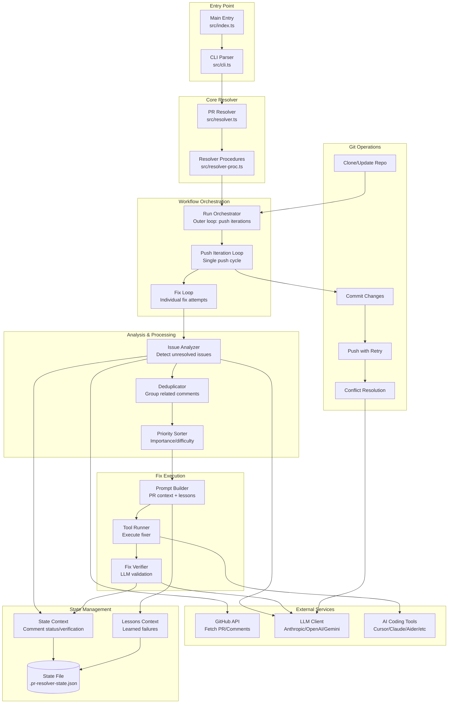

# PRR Architecture Overview

## High-Level System Architecture



---

## Directory Structure

```
src/
├── index.ts                    # Entry point, signal handling
├── cli.ts                      # CLI argument parsing
├── config.ts                   # Configuration loading
├── resolver.ts                 # Main PRResolver class
├── resolver-proc.ts            # Procedural workflow facade
│
├── workflow/                   # Workflow orchestration
│   ├── run-orchestrator.ts           # Outer loop: push iterations
│   ├── push-iteration-loop.ts        # Single push cycle
│   ├── execute-fix-iteration.ts      # Single fix attempt
│   ├── fix-loop-rotation.ts          # Escalation strategies
│   ├── issue-analysis.ts             # Comment analysis
│   ├── analysis.ts                   # Issue processing
│   ├── verification.ts               # Fix verification
│   ├── commit.ts                     # Commit & push
│   ├── startup.ts                    # Initialization
│   ├── initialization.ts             # Setup
│   └── helpers/                      # Recovery strategies
│       ├── recovery.ts
│       └── solvability.ts
│
├── state/                      # State management
│   ├── manager.ts                    # State manager
│   ├── state-context.ts              # State context API
│   ├── state-core.ts                 # Core state operations
│   ├── state-verification.ts         # Verification tracking
│   ├── state-comment-status.ts       # Comment lifecycle
│   ├── state-dismissed.ts            # Dismissed issues
│   ├── state-performance.ts          # Model performance
│   ├── lessons-*.ts                  # Lessons learned system
│   └── lock-functions.ts             # Distributed locking
│
├── github/                     # GitHub integration
│   ├── api.ts                        # GraphQL/REST API
│   └── types.ts                      # PR/Comment types
│
├── llm/                        # LLM integration
│   └── client.ts                     # Unified LLM client (prompt caching, cheap model routing)
│
├── runners/                    # AI tool integrations
│   ├── index.ts                      # Runner registry
│   ├── types.ts                      # Runner interface
│   ├── cursor.ts                     # Cursor CLI
│   ├── claude-code.ts                # Claude Code
│   ├── aider.ts                      # Aider
│   ├── gemini.ts                     # Gemini CLI
│   ├── codex.ts                      # OpenAI Codex
│   ├── llm-api.ts                    # Direct API
│   └── ...                           # Other tools
│
├── git/                        # Git operations
│   ├── clone.ts                      # Clone/update
│   ├── commit.ts                     # Commit operations
│   ├── git-push.ts                   # Push with retry
│   ├── git-conflicts.ts              # Conflict detection
│   ├── git-conflict-resolve.ts       # LLM conflict resolution
│   └── workdir.ts                    # Workdir management
│
├── analyzer/                   # Issue analysis
│   ├── prompt-builder.ts             # Analysis prompts
│   ├── severity.ts                   # Priority assessment
│   └── types.ts                      # Issue types
│
├── ui/                         # User interface
│   └── reporter.ts                   # Progress reporting
│
├── logger.ts                   # Logging & telemetry
├── constants.ts                # Constants
└── upgrade.ts                  # Tool version management
```

---

## Key Design Patterns

### 1. **Separation of Concerns**
- **Resolver**: Orchestration & state management
- **Workflow modules**: Individual workflow steps
- **Runners**: Tool-specific implementations
- **State**: Persistence & caching

### 2. **Callback-Based Architecture**
- Resolver provides callbacks to workflow modules
- Enables testing and modularity
- Avoids tight coupling

### 3. **Immutable State with Refs**
- State passed as immutable objects
- Mutations via refs for cross-iteration updates
- Clear data flow

### 4. **Procedural Facades**
- Complex logic extracted to procedural functions
- Class methods delegate to procedures
- Easier to test and reason about

### 5. **Adaptive Strategies**
- Start optimistic (batch mode)
- Escalate on failure (adaptive → single-issue → rotation)
- Learn from mistakes (lessons system)

---

## Data Flow

### 1. **Initialization Flow**
```
User Input → Parse CLI → Load Config → Create Resolver
                                      ↓
                            Setup Workspace & State
                                      ↓
                            Detect Available Tools
                                      ↓
                            Fetch PR Info from GitHub
```

### 2. **Main Processing Flow**
```
Fetch Review Comments → Analyze with LLM → Cache Status
                                          ↓
                                    Deduplicate
                                          ↓
                                    Prioritize
                                          ↓
                        ┌─────────────────┴─────────────────┐
                        ↓                                   ↓
                  Fix Loop                            Batch Mode
                  (iterate)                          (optimize)
                        ↓                                   ↓
                  Build Prompt ← Lessons Learned ─────────┘
                        ↓
                  Run Fixer Tool
                        ↓
                  Verify with LLM
                        ↓
              ┌─────────┴─────────┐
              ↓                   ↓
          Success             Failure
              ↓                   ↓
      Mark Verified       Record Lesson
              ↓                   ↓
      Update State       Try Escalation
              ↓                   ↓
      Continue            Rotate Model/Tool
```

### 3. **State Persistence Flow**
```
In-Memory State ──┬──> Write to .pr-resolver-state.json
                  ├──> Export to .prr/lessons.md
                  ├──> Sync to CLAUDE.md
                  ├──> Sync to AGENTS.md
                  └──> Sync to .cursor/rules/
```

### 4. **Escalation Flow**
```
Batch (50) → Batch (25) → Batch (12) → Batch (6) → Batch (5)
                                                        ↓
                                                Single-Issue (1-3)
                                                        ↓
                                                Model Rotation
                                                        ↓
                                                Tool Rotation
                                                        ↓
                                                Direct LLM API
                                                        ↓
                                                    Bail Out
```

---

## Critical Performance Optimizations

### 1. **Comment Status Caching**
- **Location**: `src/state/state-comment-status.ts`
- **Benefit**: Skip LLM re-analysis for comments on unmodified files
- **Key**: File content hash invalidation

### 2. **Prefetched Comments**
- **Location**: `src/workflow/run-orchestrator.ts`
- **Benefit**: Avoid redundant GitHub API fetch on first iteration
- **Method**: Pass prefetched data from setup phase

### 3. **Two-Phase Deduplication**
- **Location**: `src/workflow/issue-analysis.ts`
- **Phase 1**: Heuristic grouping (file + line)
- **Phase 2**: LLM semantic analysis
- **Benefit**: Minimize expensive LLM calls

### 4. **Adaptive Batch Sizing**
- **Location**: `src/workflow/execute-fix-iteration.ts`
- **Strategy**: Halve batch on consecutive failures
- **Benefit**: Find optimal context window for model

### 5. **Model Family Interleaving**
- **Location**: `src/models/rotation.ts`
- **Strategy**: Claude → GPT → Gemini (round-robin families)
- **Benefit**: Avoid same-family failure patterns

### 6. **Spot-Check Verification**
- **Location**: `src/workflow/analysis.ts`
- **Strategy**: Sample 5 issues before full batch verification
- **Benefit**: Reject false "already fixed" claims early

### 7. **Anthropic Prompt Caching**
- **Location**: `src/llm/client.ts` (`completeAnthropic`)
- **Strategy**: System prompts sent as block-format content with `cache_control: { type: 'ephemeral' }`. Static instruction headers for batch analysis and per-comment checks extracted into system prompts to maximize cache hit rate.
- **Benefit**: Cache reads cost 90% less than base input tokens. First call pays a 1.25x write premium; all subsequent calls with the same system prompt prefix get 90% discount.
- **WHY**: PRR makes many sequential Anthropic calls with identical instructions (e.g., 2+ batches in `batchCheckIssuesExist`, N per-comment checks in `checkIssueExists`). Without caching, every call re-processes the same static instructions at full price. Anthropic's prefix caching is free to enable (add `cache_control` to content blocks) — the API automatically finds and reuses the longest matching cached prefix.
- **Observability**: Cache hit/miss stats logged via `debug('Anthropic prompt cache', ...)` with estimated savings percentage. `LLMResponse.usage` includes `cacheCreationInputTokens` and `cacheReadInputTokens`.

### 8. **Focused-Section Mode for Direct LLM Fix**
- **Location**: `src/workflow/helpers/recovery.ts` (`tryDirectLLMFix`)
- **Strategy**: For files >15K chars, send only ±150 lines around the issue line instead of the full file. LLM fixes the section, which is spliced back into the original file. Full-file mode preserved for small files and when line number is unknown.
- **Benefit**: ~90% reduction in input tokens for large files. Also reduces output tokens (LLM reproduces ~300 lines instead of entire file) and avoids output truncation.
- **WHY**: The original approach embedded up to 100K chars (~25K tokens) of full file content in every prompt, even when the issue was on a single line. This wasted input tokens on irrelevant code AND forced the LLM to reproduce the entire file in its output — often hitting the output token limit before finishing. The code extraction regex would then fail on the truncated response, silently discarding the fix.

### 9. **Cheap Model Routing**
- **Location**: `src/llm/client.ts` (`CHEAP_MODELS`, `generateCommitMessage`, `generateDismissalComment`)
- **Strategy**: Low-stakes text generation tasks (commit messages, dismissal comments) use inexpensive models (Haiku for Anthropic, GPT-4o-mini for OpenAI/ElizaCloud) instead of the default verification model.
- **Benefit**: ~66% cost reduction on these calls with zero quality impact.
- **WHY**: A one-line commit message or dismissal comment is constrained text generation — it doesn't require the reasoning capability of Sonnet or GPT-4o. Haiku ($1/$5 per MTok) produces equivalent quality at 1/3 the price of Sonnet ($3/$15 per MTok) for this task.

### 10. **Infrastructure Failure Fast-Path**
- **Location**: `src/workflow/helpers/recovery.ts` (`isInfrastructureFailure`), applied in `recovery.ts` and `fix-verification.ts`
- **Strategy**: Detect infrastructure failures (quota, rate limit, timeout, crash, OOM, HTTP 5xx) in verification explanations. Skip the `analyzeFailedFix` LLM call and record a plain-text lesson instead.
- **Benefit**: Saves one LLM call per infrastructure failure.
- **WHY**: When a fix fails because the API returned "429 Quota/rate limit exceeded", asking an LLM "why did this fix fail?" is pure waste — the answer is obvious and doesn't need AI analysis. The plain-text lesson ("infra failure: quota exceeded") is equally useful for future iterations.

### 11. **Redundant Verification Skip**
- **Location**: `src/workflow/fix-verification.ts` (`verifyFixes`)
- **Strategy**: Check `Verification.isVerified()` before adding issues to the verification queue. Issues already confirmed fixed by recovery phases (`trySingleIssueFix`, `tryDirectLLMFix`) are skipped.
- **Benefit**: Saves one verification call per already-resolved issue.
- **WHY**: Without this check, issues verified during recovery were re-verified in the main pass — each a separate `verifyFix` call or batch slot in `batchVerifyFixes`. The fix was already confirmed good; re-verifying wastes tokens on a known result.

---

## Error Handling & Resilience

### 1. **Graceful Shutdown**
- **File**: `src/workflow/graceful-shutdown.ts`
- Single Ctrl+C: Save state, print summary, clean exit
- Double Ctrl+C: Force exit immediately

### 2. **State Persistence**
- **File**: `src/state/manager.ts`
- Auto-save on every state mutation
- Resume from interruption

### 3. **Conflict Auto-Resolution**
- **File**: `src/git/git-conflict-resolve.ts`
- Lock files: Regenerate via package manager
- Code files: LLM-powered resolution (2 attempts)

### 4. **Push Retry with Rebase**
- **File**: `src/git/git-push.ts`
- On rejection: Pull, rebase, retry
- Auto-inject GitHub token to remote URL

### 5. **Distributed Locking**
- **File**: `src/state/lock-functions.ts`
- Prevent parallel instances on same PR
- Graceful release on exit

---

## Extension Points

### Adding a New AI Tool

1. Create `src/runners/my-tool.ts`:
```typescript
import type { Runner } from './types.js';

export const myToolRunner: Runner = {
  name: 'my-tool',
  binaryName: 'my-tool-cli',
  isAvailable: async () => { /* check binary */ },
  getModels: async () => { /* return model list */ },
  execute: async (prompt, options) => { /* run tool */ },
};
```

2. Register in `src/runners/index.ts`:
```typescript
import { myToolRunner } from './my-tool.js';
const ALL_RUNNERS = [myToolRunner, ...];
```

### Adding a New LLM Provider

1. Update `src/llm/client.ts`:
```typescript
private async createClient() {
  if (this.config.llmProvider === 'my-provider') {
    return new MyProviderClient(this.config.myProviderApiKey);
  }
}
```

2. Update `src/config.ts`:
```typescript
export const llmProviders = ['anthropic', 'openai', 'my-provider'] as const;
```

### Adding a New Workflow Phase

1. Create `src/workflow/my-phase.ts`:
```typescript
export async function executeMyPhase(context: PhaseContext): Promise<PhaseResult> {
  // Your workflow logic
}
```

2. Import in `src/resolver-proc.ts`:
```typescript
export { executeMyPhase } from './workflow/my-phase.js';
```

3. Call from orchestrator or resolver:
```typescript
const result = await ResolverProc.executeMyPhase(context);
```

---

## Testing Strategy

### Unit Tests
- Pure functions in workflow modules
- State mutations
- Prompt builders
- Parser functions

### Integration Tests
- Runner execution (mocked tools)
- LLM client (mocked API)
- Git operations (temp repos)

### End-to-End Tests
- Full workflow with real PR
- Mock GitHub API responses
- Verify state persistence

### Test Files
```
tests/
├── normalizeLessonText.test.ts
├── lessons-normalize.test.ts
└── lessons.test.ts
```

---

## Configuration

### Environment Variables
```bash
# Required
GITHUB_TOKEN=ghp_xxx

# LLM Provider (pick one)
ANTHROPIC_API_KEY=sk-ant-xxx
OPENAI_API_KEY=sk-xxx
ELIZACLOUD_API_KEY=xxx

# Optional
PRR_TOOL=cursor                          # Default fixer tool
PRR_LLM_PROVIDER=anthropic               # LLM provider
PRR_LLM_MODEL=claude-sonnet-4-5          # LLM model
```

### CLI Options
See `src/cli.ts` for all options. Key ones:

```bash
--tool cursor              # Fixer tool
--model o3                 # Override model
--auto-push                # Loop until all resolved
--max-fix-iterations 10    # Limit iterations
--max-stale-cycles 2       # Bail out threshold
--priority-order important # Issue sorting
--reverify                 # Clear verification cache
--dry-run                  # Analyze only
```

---

## Monitoring & Observability

### Logging
- **Output log**: `~/.prr/output.log` (all console output, ANSI-stripped)
- **Debug prompts**: `~/.prr/debug/*.txt` (with `--verbose`)

### Metrics Tracked
- Issues analyzed / fixed / dismissed
- LLM token usage per phase
- Anthropic prompt cache stats (creation/read tokens, savings %)
- Model performance (fixes vs failures per model)
- Timing per phase (fetch, analyze, fix, verify, commit)
- Bot response times (for smart wait calculation)

### Reports
- **Model Performance**: Which models succeeded/failed
- **Session Stats**: This run vs overall
- **After Action Report**: Remaining issues + recommendations
- **Lessons Learned**: What was tried and what failed

---

## Security Considerations

### 1. **API Key Protection**
- Loaded from `.env` only
- Never logged or committed
- Injected to remote URL when needed (push authentication)

### 2. **Command Injection Prevention**
- Model names validated with regex
- PR URLs parsed and validated
- No shell interpolation of user input

### 3. **Workdir Isolation**
- Hash-based unique directories (`~/.prr/work/<hash>`)
- Cleaned up by default (unless `--keep-workdir`)

### 4. **State File Security**
- Added to `.gitignore` automatically
- Contains no secrets (only PR metadata)

### 5. **Lock File Safety**
- Prevents parallel instances
- Includes PID for stale lock detection
- Auto-cleanup on graceful shutdown

---

## Future Enhancements

### Planned Features
- [ ] Parallel issue fixing (independent issues)
- [ ] PR review posting (summarize changes)
- [ ] Custom lesson templates
- [ ] Web UI for monitoring
- [ ] Multi-PR batch processing
- [ ] Lesson sharing across repos

### Ideas for Improvement
- Improve model selection heuristics (e.g., cross-reference recommendations with provider health)
- Add more AI tool integrations
- Fast-fail on consecutive quota exhaustion (skip provider after 2-3 identical failures)
- Better conflict resolution strategies
- Team collaboration features

---

## References

- **Main README**: `README.md`
- **Flowcharts**: `docs/flowchart.md`
- **Development Guide**: `DEVELOPMENT.md`
- **Changelog**: `CHANGELOG.md`
