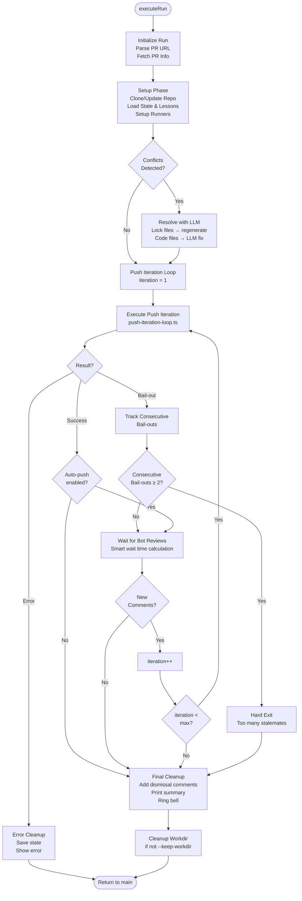
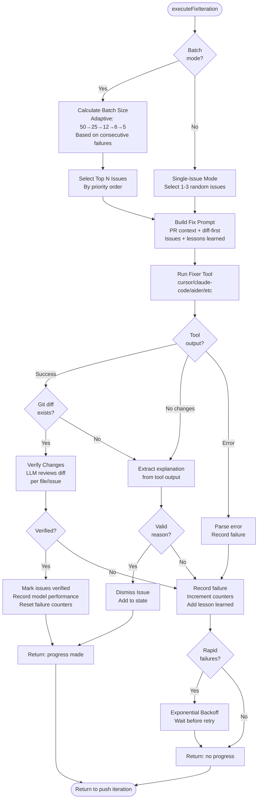
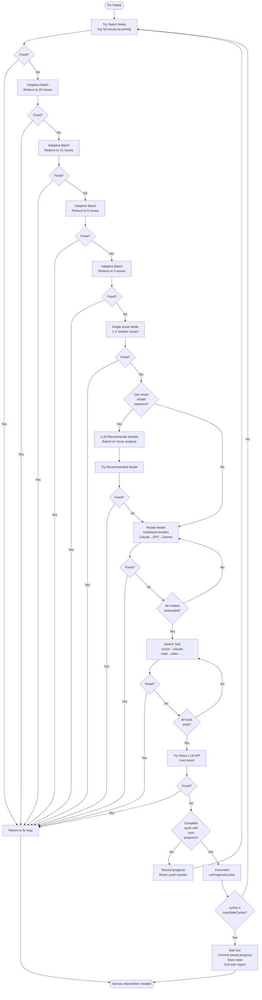
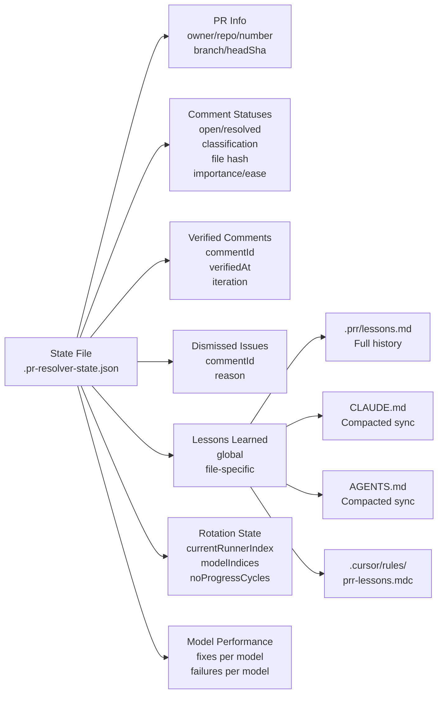
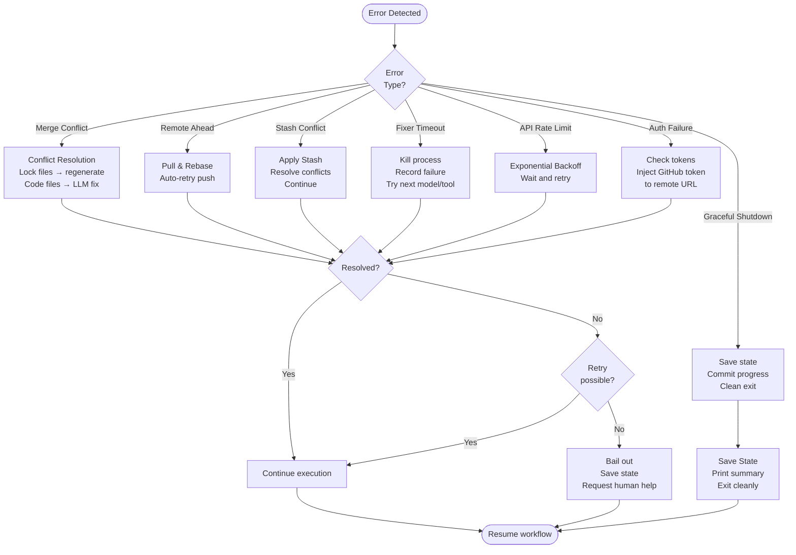
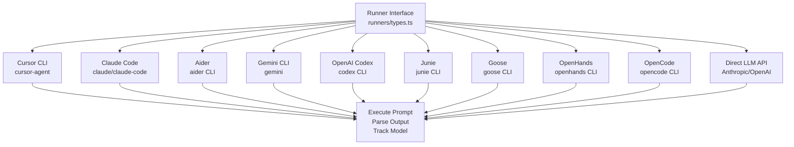

# PRR (PR Resolver) - System Flowchart

## Overview
PRR automatically resolves PR review comments using LLM-powered fixing and verification through multiple escalation strategies.

---

## Main System Flow

```mermaid
flowchart TD
    Start([User runs: prr PR_URL]) --> ParseCLI[Parse CLI Arguments<br/>cli.ts]
    ParseCLI --> CheckMode{Special<br/>Mode?}
    
    CheckMode -->|--check-tools| CheckTools[Show Tool Status<br/>& Exit]
    CheckMode -->|--update-tools| UpdateTools[Update All Tools<br/>& Exit]
    CheckMode -->|--tidy-lessons| TidyLessons[Clean Lessons<br/>& Exit]
    CheckMode -->|Normal Run| LoadConfig[Load Config<br/>config.ts]
    
    LoadConfig --> CreateResolver[Create PRResolver<br/>resolver.ts]
    CreateResolver --> InitLog[Start Output Log<br/>~/.prr/output.log]
    InitLog --> SetupSignals[Setup Signal Handlers<br/>SIGINT/SIGTERM]
    SetupSignals --> RunResolver[resolver.run(prUrl)]
    
    RunResolver --> Orchestrator[Run Orchestrator<br/>run-orchestrator.ts]
    
    CheckTools --> End([Exit])
    UpdateTools --> End
    TidyLessons --> End
```

---

## Orchestrator: Outer Loop



---

## Push Iteration: Single Push Cycle

```mermaid
flowchart TD
    Start([executePushIteration]) --> FetchComments[Fetch Review Comments<br/>GraphQL API<br/>Inline threads + Issue comments]
    
    FetchComments --> CheckCache{Comment<br/>status<br/>cached?}
    CheckCache -->|Yes, file unchanged| SkipAnalysis[Skip LLM analysis<br/>Use cached status]
    CheckCache -->|No or file changed| AnalyzeComments[Analyze Comments<br/>LLM: 'Is issue still present?'<br/>Classify: exists/fixed/unclear]
    
    SkipAnalysis --> Dedup
    AnalyzeComments --> Dedup[Deduplicate Issues<br/>Heuristic + LLM semantic]
    
    Dedup --> FilterSolvable[Filter Solvable Issues<br/>Skip deleted files, stale refs]
    FilterSolvable --> PrioritySort[Sort by Priority<br/>importance/ease/newest/oldest]
    
    PrioritySort --> CheckIssues{Any<br/>unresolved<br/>issues?}
    
    CheckIssues -->|No| CheckChanges{Changes<br/>exist?}
    CheckIssues -->|Yes| FixLoop[Fix Loop<br/>iteration = 1]
    
    FixLoop --> PreChecks[Pre-Iteration Checks<br/>Pull remote if ahead<br/>Check for new comments]
    PreChecks --> ExecuteFix[Execute Fix Iteration<br/>execute-fix-iteration.ts]
    
    ExecuteFix --> FixResult{Result?}
    
    FixResult -->|Changes made| VerifyFixes[Verify Fixes<br/>LLM: 'Does diff fix issue?']
    FixResult -->|No changes| HandleNoChanges[Parse no-changes explanation<br/>Dismiss if valid reason]
    FixResult -->|Error| HandleError[Handle Fixer Error<br/>Record lesson learned]
    
    VerifyFixes --> UpdateCache[Update Comment Status<br/>Mark verified/unresolved<br/>Track file hashes]
    UpdateCache --> CheckCommit{Incremental<br/>commit?}
    
    HandleNoChanges --> CheckAllFixed
    HandleError --> CheckRotation
    
    CheckCommit -->|Yes| CommitIter[Commit Iteration<br/>LLM-generated message]
    CheckCommit -->|No| CheckAllFixed
    
    CommitIter --> CheckAllFixed{All<br/>fixed?}
    
    CheckAllFixed -->|Yes| FinalAudit
    CheckAllFixed -->|No| CheckMaxIter{iteration <<br/>max?}
    
    CheckMaxIter -->|Yes| IncrementFix[iteration++]
    CheckMaxIter -->|No| CheckRotation{Try<br/>rotation?}
    
    IncrementFix --> FixLoop
    
    CheckRotation -->|Yes| RotateStrategy[Rotation Strategy<br/>fix-loop-rotation.ts]
    CheckRotation -->|No| BailOut[Execute Bail-out<br/>Commit partial progress]
    
    RotateStrategy --> RotResult{Success?}
    RotResult -->|Yes| FixLoop
    RotResult -->|No| BailOut
    
    FinalAudit[Final Audit<br/>Adversarial re-verification<br/>Clear cache first]
    FinalAudit --> AuditResult{All<br/>verified?}
    
    AuditResult -->|Yes| CheckChanges
    AuditResult -->|No| MoreIssues[More iterations needed]
    MoreIssues --> CheckMaxIter
    
    CheckChanges -->|Yes| CommitPush[Commit & Push<br/>Squash commit<br/>Auto-rebase on rejection]
    CheckChanges -->|No| ReturnSuccess
    
    CommitPush --> ReturnSuccess[Return: shouldBreak=false<br/>Continue to next push iteration]
    BailOut --> ReturnBailout[Return: shouldBreak=false<br/>bailOut=true]
    
    ReturnSuccess --> End([Return to orchestrator])
    ReturnBailout --> End
```



---

## Fix Iteration: Single Fix Attempt



---

## Escalation Strategy: When Fixes Fail



---

## State Management



---

## LLM Usage Points

```mermaid
flowchart TD
    Start([LLM API Calls]) --> Analysis[Comment Analysis<br/>'Is issue still present?'<br/>Classify + assess priority]
    
    Start --> Dedup[Semantic Deduplication<br/>Group related comments<br/>from different reviewers]
    
    Start --> Solvability[Solvability Detection<br/>Can this be automated?<br/>Skip deleted files, etc]
    
    Start --> ModelRec[Model Recommendation<br/>Which models best<br/>for these issues?]
    
    Start --> Fixer[Fixer Tool Execution<br/>Generate code fixes<br/>Via tool-specific APIs]
    
    Start --> Verification[Fix Verification<br/>'Does diff fix issue?'<br/>Per file/comment]
    
    Start --> FinalAudit[Final Audit<br/>Adversarial recheck<br/>Find what's NOT fixed]
    
    Start --> ConflictResolve[Conflict Resolution<br/>Merge conflict fixing<br/>Via LLM tools]
    
    Start --> CommitMsg[Commit Messages<br/>Generate from diff<br/>Describe changes]
    
    Start --> LessonAnalysis[Lesson Analysis<br/>Why did fix fail?<br/>Actionable guidance]
```



---

## Key Features Visualization

### Comment Status Caching
```
┌─────────────────────────────────────────────┐
│ Comment on file.ts (hash: abc123)          │
│ Status: OPEN (issue exists)                │
│ Classification: "exists"                   │
│ Last analyzed: iteration 5                 │
└─────────────────────────────────────────────┘
                    │
                    ▼
         File not modified? ──Yes──> Skip LLM analysis
                    │                (use cached status)
                    No
                    │
                    ▼
         File hash changed (abc123 → def456)
                    │
                    ▼
         Re-run LLM analysis
         (fix may have resolved issue)
```

### Adaptive Batch Sizing
```
Iteration 1: 50 issues → 0 fixed
Iteration 2: 25 issues → 0 fixed  (halved)
Iteration 3: 12 issues → 0 fixed  (halved)
Iteration 4: 6 issues  → 0 fixed  (halved)
Iteration 5: 5 issues  → 0 fixed  (halved)
Iteration 6: 1-3 random issues (single-issue mode)
```

### Model Family Interleaving
```
Round 1:
  ├─ Claude Sonnet (Claude family)
  ├─ GPT-4o (GPT family)
  └─ Gemini Pro (Gemini family)

Round 2:
  ├─ Claude Opus (Claude family)
  ├─ GPT-5 (GPT family)
  └─ o3-mini (OpenAI reasoning family)

...until all models exhausted → switch tool
```

---

## Error Recovery & Resilience



---

## Tool Integration Architecture



---

## Data Flow Summary

```
User Input (PR URL)
    ↓
Parse & Validate
    ↓
Fetch PR Info (GitHub API)
    ↓
Clone/Update Repository
    ↓
Load State & Lessons
    ↓
Fetch Review Comments
    ↓
Analyze Comments (LLM)
    ↓
Filter & Prioritize Issues
    ↓
╔═══════════════════════════╗
║   FIX LOOP                ║
║   ├─ Build Prompt         ║
║   ├─ Run Fixer Tool       ║
║   ├─ Verify Fixes (LLM)   ║
║   ├─ Update State         ║
║   ├─ Commit (optional)    ║
║   └─ Rotate if needed     ║
╚═══════════════════════════╝
    ↓
Final Audit (LLM)
    ↓
Commit & Push Changes
    ↓
Wait for Bot Reviews
    ↓
Check New Comments
    ↓
Repeat or Exit
    ↓
Print Summary & Stats
```

---

## Performance Optimizations

### 1. Comment Status Caching
- **Problem**: Re-analyzing unchanged files wastes tokens
- **Solution**: Cache LLM analysis with file content hash
- **Result**: Skip redundant API calls on unmodified files

### 2. Prefetched Comments
- **Problem**: Fetching comments twice (setup + iteration)
- **Solution**: Pass prefetched data from setup to first iteration
- **Result**: Save ~3s and 3 API calls per run

### 3. Deduplication (Two-Phase)
- **Problem**: Multiple reviewers flag same issue
- **Solution**: Heuristic grouping (file+line) → LLM semantic analysis
- **Result**: Process only canonical issues, auto-verify duplicates

### 4. Batch Verification
- **Problem**: Verifying 50+ issues individually is slow
- **Solution**: Group by ~400K char context windows
- **Result**: Parallel verification with controlled token usage

### 5. Model Discovery Cache
- **Problem**: Querying available models on every run
- **Solution**: Cache model lists per tool
- **Result**: Faster startup, fewer API calls

### 6. Spot-Check Verification
- **Problem**: Expensive full batch verification on "already fixed" claims
- **Solution**: Sample 5 issues first, full verify only if passing
- **Result**: Reject false positives early, save tokens

---

## Exit Reasons

| Reason | Description | Next Action |
|--------|-------------|-------------|
| `all_fixed` | All issues resolved | Success! |
| `dry_run` | Dry-run mode completed | Review issues |
| `no_comments` | No review comments found | Nothing to do |
| `bail_out` | Stalemate after max cycles | Manual review needed |
| `outer_bailout` | Consecutive bailouts (outer loop) | Manual intervention |
| `max_iterations` | Hit max fix iterations | Increase limit or investigate |
| `user_interrupt` | Ctrl+C pressed | Resume or inspect |
| `error` | Unexpected error occurred | Check logs |
| `no_changes` | No changes after fixes | Already addressed? |
| `lock_failed` | Could not acquire lock | Another instance running |
| `cleanup_mode` | Cleanup completed | Clean state restored |

---

## Summary

**PRR** is a sophisticated autonomous PR resolution system that:

1. **Fetches** review comments from GitHub (inline threads + issue comments)
2. **Analyzes** which issues still exist using LLM with caching optimization
3. **Prioritizes** issues by importance/difficulty via LLM assessment
4. **Fixes** issues using multiple AI coding tools with model rotation
5. **Verifies** fixes with adversarial LLM prompts to catch false positives
6. **Escalates** through strategies: batch → adaptive → single-issue → model rotation → tool rotation → direct API
7. **Learns** from failures to avoid repeating mistakes (lessons shared via CLAUDE.md, AGENTS.md)
8. **Commits** with LLM-generated messages describing actual changes
9. **Pushes** with auto-rebase on remote conflicts
10. **Waits** for bot re-reviews and repeats until all resolved or max cycles

The system is resilient with state persistence, graceful shutdown, conflict auto-resolution, and comprehensive error recovery.
